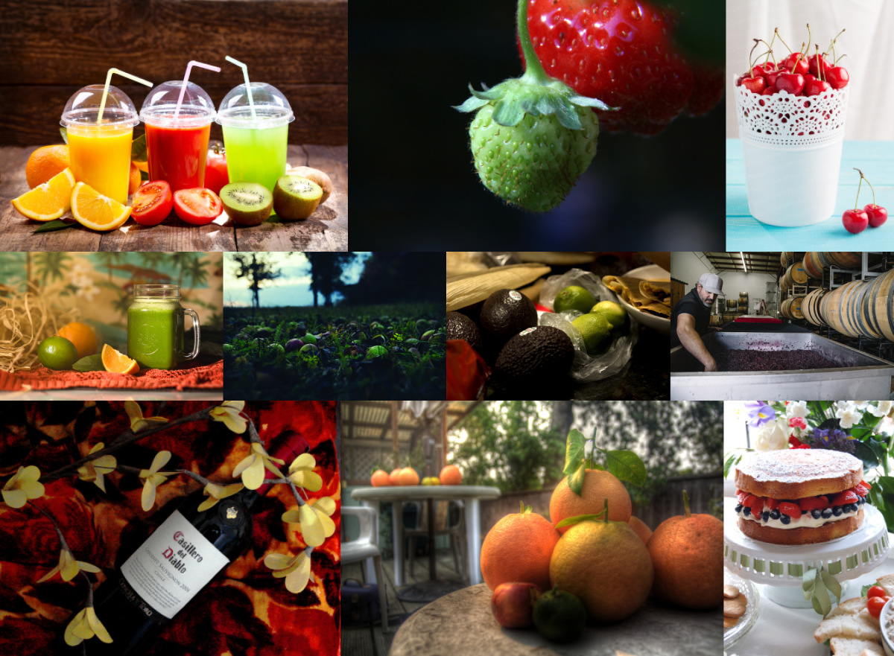

# Flickr Collage

**Flickr Collage** queries the Flickr API for the top-rated image by search keywords and assembles a collage grid from this images to a new file.



## Installation

Add this line to your application's Gemfile:

```ruby
gem 'flickr_collage', github: 'plaschczek/flickr_collage'
```

And then execute:

```console
bundle
```

You also have to install **ImageMagick**. For more details take a look at (https://github.com/rmagick/rmagick).

## Usage

First you have to initialize FlickRaw.api_key and FlickRaw.shared_secred.<br />
For example export the following env vars:

```console
export FLICKR_API_KEY='... Your API key ...'
export FLICKR_SHARED_SECRET='... Your shared secret ...'
```

Or in your Ruby file:

```ruby
require 'flickr_collage'

FlickRaw.api_key="... Your API key ..."
FlickRaw.shared_secret="... Your shared secret ..."
```

For more details take a look at (https://github.com/hanklords/flickraw#usage).

### Examples

To create a collage with 10 random images, instantiate a new FlickrCollage and save the image:

```ruby
FlickrCollage.new.save
```

Full options example (9 images, 4 by keyword, 5 random in 2 rows as squares, saved as 'tmp/fruits.jpg'):

```ruby
FlickrCollage.new(
  ['strawberry', 'kiwi', 'cherry', 'limes'],
  filename: 'fruits.jpg',
  dir: 'tmp',
  no_of_images: 9,
  rows: 2,
  squares: true
).save
```

### Options

```
FlickrCollage.new(keynames, filename:, dir:, no_of_images:, rows:, squares:)

    keynames: Array with keynames
    filename: collage filename, default 'collage.jpg'
         dir: directory to save the collage, has to exist, default '.'
no_of_images: number of images, default number of keynames and without keynames 10
        rows: number of collage rows, default sqrt(no_of_images).floor
     squares: boolean, if true images squared
```

## License

The gem is available as open source under the terms of the [MIT License](http://opensource.org/licenses/MIT).
